 

<h3><code>vansh@github ~ $ whoami</code></h3>

<table>
<tr>
<td valign="top"></td>
<td valign="top"></td>
</tr>
</table>

 

<h3><code>vansh@github ~ $ ./contributions.sh</code></h3>

 

 

## Tech Stack

 

<!-- ## 🐍 Contribution Snake

  -->

## Featured Projects

<table>
<tr>
<td width="50%" valign="top">

### Pixora
A modern media discovery platform for exploring high-quality photos, videos, and GIFs. Search, save, download, and share content seamlessly through a fast, intuitive interface.

`React` `Media API`

</td>
<td width="50%" valign="top">

### Netflix UI Clone
A pixel-perfect Netflix-inspired streaming interface built with Next.js and Tailwind CSS. Fully responsive layout with modern UI components and a smooth experience across devices.

`Next.js` `Tailwind CSS`

</td>
</tr>
<tr>
<td width="50%" valign="top">

### Lorem Picsum Photo Pedia
A React-based image gallery that fetches and displays high-quality random images from the Lorem Picsum API. Responsive design, pagination, downloads, and Axios integration.

`React` `Axios` `REST API`

</td>
<td width="50%" valign="top"></td>
</tr>
</table>

 

<i>Thanks for stopping by — let's build something considered.</i>

