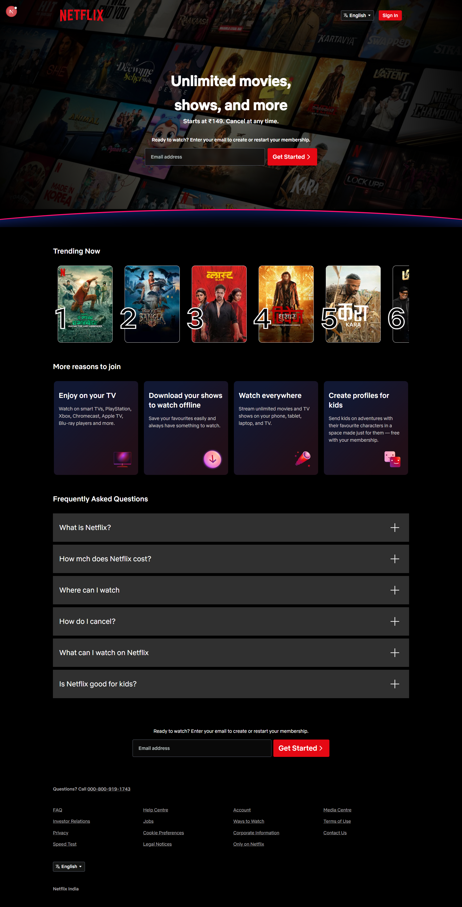

 

<strong>About Me</strong>

<!-- <h3><code>vansh@github ~ $ whoami</code></h3> -->

<table>
<tr>
<td valign="top"></td>
<td valign="top"></td>
</tr>
</table>

 

<!-- <h3><code>vansh@github ~ $ ./contributions.sh</code></h3> -->

<strong>Contributions</strong>

 
 

  

 

 

<strong>Tech Stack</strong>

 

<!-- ## 🐍 Contribution Snake

  -->

<strong>Featured Projects</strong>

<table>
<tr>
<td width="50%" valign="top">

### Pixora

 
A modern media discovery platform for exploring high-quality photos, videos, and GIFs. Search, save, download, and share content seamlessly through a fast, intuitive interface.

<!-- `React` `Media API` -->
 

</td>

<td width="50%" valign="top">

### Lorem Picsum Photo Pedia

  
A React-based image gallery that fetches and displays high-quality random images from the Lorem Picsum API. Responsive design, pagination, downloads, and Axios integration.

<!-- `React` `Axios` `REST API` -->
 

</td>

</tr>
<tr>

<td width="50%" valign="top">

### Netflix UI Clone

  
A pixel-perfect Netflix-inspired streaming interface built with Next.js and Tailwind CSS. Fully responsive layout with modern UI components and a smooth experience across devices.

<!-- `Next.js` `Tailwind CSS` -->
 

</td>

<td width="50%" valign="top"></td>
</tr>
</table>

 

<code>console.log("Thanks for scrolling");</code>

